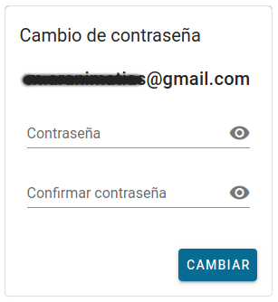
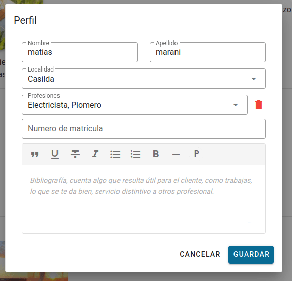

---
tags:
  - registrarse con email
  - registrarse con google
  - registrarse con facebook
  - olvide mi contraseña
  - recuperar contraseña
---

# Profesional

**Menu**
[[TOC]]

## Crear una cuenta

Para crear una cuenta de forma **manual** ingresando a [/singup](/singup) o de forma
**automática** en [/login](/login) y elegir crear una cuenta con **Google**,
**Facebook** esta opción crea una cuenta y posteriormente puedes
iniciar cesión con estos botones.

### Cuenta con google o facebook

1. Buscar en la parte superior derecha de la pantalla el botón _"iniciar session"_.

2. Click en el botón correspondiste a la cuenta quieres asociar con ContrataDos,
   puede ser **Google**, **Facebook**.

3. Según sea la cuenta **Google**, **Facebook**, se le pedira
   que le de permiso a ContrataDos para obtener datos personales, como ser email,
   nombre, apellido y la imagen de perfil de que uses en esa red social.
4. Cuando el proceso termine veras un mensaje de bienvenida

   

5. Click en _"soy un profesional"_.
6. Complete el formulario, los clientes que vean tú perfil entiendan cuales son
   tus habilidades y servicios que ofreces.

   

### Cuenta manual o local

1. Buscar en la parte superior derecha de la pantalla el botón _"iniciar session"_.

2. Click en el botón _'crear cuenta'_, veras un formulario como este:

3. Completo todos los campos.
4. Una vez completado los campos y pulsar _'crear cuenta'_ recibirás un mensaje
   como este:

5. Ve a su correo y pulsa en el link que dice _'Confirmar dirección de correo'_.

   El correo debe ser como este:

   

6. La hacer click, te llevara a la pagina de contratado y comprobara tu email, mostrando
   el email con una tilde (un check) verde.

   

7. Ahora solo tienes que ingresar tu contraseña y pulsar iniciar session.
8. Veras un mensaje de bienvenida, te recomendamos que vallas a perfil y
   lo personalices agregando una foto.

   

9. Click en _"soy un profesional"_.
10. Complete el formulario, los clientes que vean tú perfil entiendan cuales son
    tus habilidades y servicios que ofreces.

    

## Iniciar secesión

Solo tienes que dirigirse a [/login](/login) y si asociaste ContrataDos con
**Google**, **Facebook** solo tienes que hacer click en el botón correspondiste,
en caso de tener una cuenta local o creada de forma manual, solo ingrese el
correo (email) y la contraseña que ingresaste al crear la cuenta.

::: tip Nota
Para iniciar session con _email_ y _contraseña_ primero tienes que tener haber creado
una cuenta en ContrataDos.
:::

## Olvidé mi contraseña

Para recuperar su contraseña solo tiene que indicarle a sistema que se la olvidó.

1. Ir a [/login](/login) (iniciar session), completar con el email que se registro
   y pulsar el texto que dice _'¿Olvidaste tu contraseña?'_.
2. Luego le estará llegado un email a esa cuenta de correo electrónico.

Veras un mensaje como este

3. Ir al email y hacer click en el texto que dice
   _'Para cambiar la contraseña click acá.'_

4. Ese link te llevara a la pagina de ContrataDos con un formulario que te permite
   ingresar un nueva contraseña. Ingrese la nueva contraseña en cada campo
   y pulse cambiar.

5. Cuando completas el formulario, si sale todo bien veras un mensaje como el siguiente.

6. Click en el botón _'Iniciar secesión'_ y ya puedes usar la nueva contraseña.

## Buscar o contratar profesional

Ir a la pagina principal de ContrataDos. Puedes llegar hacendo click en el logo
de ContrataDos.

1. Veras un buscador.

2. Ingrese una profesional o localidad y el buscador inteligente le seguridad
   una opción, agregue las que le parezca.

3. Un vez elegido lo que quieres buscar, pulse el botón _'Buscar un profesional'_.

4. Puede pasar que la búsqueda no arroje un resultado, en ese caso cambie los
   criterios de búsqueda.

::: tip Nota
Si usted es un profesional no aparecerá en su propia búsqueda
:::

5. Listado de profesionales que concuerdan con su búsqueda.

> De cada profesional se muestra información básica, nombre, apellido, profesión,
> foto de perfil y una descripción.

> Las estrellas muestra cuan satisfecho están los clientes con los trabajo que
> realizo el profesional.
>
> La evaluación del profesional se vera cuando tenga más de 10 trabajo
> evaluados.

6. En cada tarjeta de profesional puedes elegir contratarlo o ver su perfil.

::: tip Nota
Para contratar un profesional debes estar logeado en ContrataDos
:::

7. Al hacer click en el botón contratar, aparecerá un formulario donde puedes
   indicar y contar el trabajo que se necesita.

8. Un ves completado el formulario y enviado (pulsando _'Contratar'_), se le envía
   un email al profesional, también ya puede ver la solicitud de trabajo en su
   listado de trabajo, también ya puede ver la solicitud de trabajo en su listado
   de trabajos.

9. Ver el estado y los detalles de la solicitud, haciendo click en _'trabajos'_ del
   menu principal.

Vera algo como lo siguiente:

::: tip Notas

- Click en _'ver chat'_ para ver la conversación con el profesional.
- También se puede acordar una cita.
- Cada vez que alguno de los dos escriba un mensaje le llegar a demás del mismo
  un email notification que tiene un mensaje, (si tiene los email habilitados).

:::

## Editar mi perfil

En la pagina de tu perfil, podrás cambiar información personal, y agregar o
editar tu bibliografía, cambiar o agregar una foto de perfil, también desactivar
el envió de **notificaciones** por email.

### Cambiar información personal

1. Estar logeado en ContrataDos, ver como en [Iniciar Secesión](#iniciar-secesion)
2. Ir a tu perfil, haciendo click en _'Perfil'_ que aparece en el menu, arriba a
   la derecha de la pantalla.
3. Cambiar información personal, buscar el icono de lápiz.

4. Al hacer click aparecerá un 'modal', una ventana, como esta:

::: details ¿Donde cambiar mi bibliografía?
Escriba lo que quietas en este recuadro y puedes usar las herramientas de texto.

:::

### Cambiar foto de perfil

1. Estar logeado en ContrataDos, ver como en [Iniciar Secesión](#iniciar-secesion)
2. Ir a tu perfil, haciendo click en _'Perfil'_ que aparece en el menu, arriba a
   la derecha de la pantalla.
3. Para cambiar la foto de perfil, simplemente solo tienes que hacer click
   en la foto o el icono de usuario.

> 'Foto' predeterminada, para usuario sin foto.

A pasar el mouse por arriba veras ese icono, hace click.

4. Se abrirá una ventana para que puedas elegir una tofo desde tu computadora,
   elija la que mas le convenga y puse _'aceptar'_.
5. Luego se le mostrar una ventana con la foto que eligió y un rectángulo, para que
   recorte la foto al tamaño adecuado.

6. Cuando ya acomodo la foto pulse _'guardar'_.
7. Cuando la goto fue subida se actualizar automáticamente.

### Cambiar mi cuenta a profesional o trabajador

1. Estar logeado en ContrataDos, ver como en [Iniciar Secesión](#iniciar-secesion)
2. Ir a tu perfil, haciendo click en _'Perfil'_ que aparece en el menu, arriba a
   la derecha de la pantalla.
3. Cambiar a una cuenta profesional, buscar el icono de lápiz.

4. Al hacer click aparecerá un 'modal', una ventana, como esta:

5. Y click en el botón _'Darme de alta como un trabajador'_.
6. Ahora aparecerá un campo para que marques que habilidades quieres ofrecer.

### Dejar de ser un profesional o trabajador

1. Estar logeado en ContrataDos, ver como en [Iniciar Secesión](#iniciar-secesion)
2. Ir a tu perfil, haciendo click en _'Perfil'_ que aparece en el menu, arriba a
   la derecha de la pantalla.
3. Dejar de ser profesional o trabajador, buscar el icono de lápiz.

4. Al hacer click aparecerá un 'modal', una ventana, como esta:

5. Y click en el icono del tacho de basura rojo.

### Activar o Desactivar notificaciones por email

1. Estar logeado en ContrataDos, ver como en [Iniciar Secesión](#iniciar-secesion)
2. Ir a tu perfil, haciendo click en _'Perfil'_ que aparece en el menu, arriba a
   la derecha de la pantalla.
3. Desactivar o activar las notificaciones, buscar el icono de la campana.

- Notificaciones activadas
  

- Notificaciones desactivadas
  

::: tip Nota
No afecta a los email para el cambio de contraseña.
:::

### ¿Porque veo 'Todavía no tiene suficientes trabajos'?

Eso significa que el trabajador no tiene suficientes trabajos clasificados como para
calcular su puntuación.
Debe tener más de 10 trabajos publicados.
