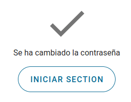

---
tags:
  - registrarse con email
  - registrarse con google
  - registrarse con facebook
  - registrarse con linkedin
---

# Profesional

**Menu**
[[TOC]]

## Crear una cuenta

Para crear una cuenta de forma **manual** ingresando a [/singup](/singup) o de forma
**automática** en [/login](/login) y elegir crear una cuenta con **Google**,
**Facebook** o **LinkedIn** esta opción crea una cuenta y posteriormente puedes
iniciar cesión con estos botones.

### Cuenta con google o facebook o linkedin

1. Buscar en la parte superior derecha el icono de usuario 
2. Click en el botón correspondiste a la cuenta quieres asociar con ContrataDos,
   puede ser **Google**, **Facebook** o **LinkedIn**

   

3. Según sea la cuenta **Google**, **Facebook** o **LinkedIn**, se le pedira
   que le de permiso a ContrataDos para obtener datos personales, como ser email,
   nombre, apellido y la imagen de perfil de que uses en esa red social.
4. Cuando el proceso termine veras un mensaje de bienvenida, te recomendamos
   que vallas a perfil y para actualizar sus datos.

### Cuenta manual o local

1. Buscar en la parte superior derecha el icono de usuario 
2. Click en el botón _'crear cuenta'_, veras un formulario como este:

   

3. Completo todos los campos y en _'tipo de usuario'_ puedes marcar la opción _profesional_
   para crear una cuenta de ese tipo.
4. Una vez completado los campos y pulsar _'crear cuenta'_ recibirás un mensaje
   como este:

   

5. Ve a su correo y pulsa en el link que dice _'Confirmar dirección de correo'_.

   El correo debe ser como este:

   

6. La hacer click, te llevara a la pagina de contratado y comprobara tu email, mostrando
   el email con una tilde (un check) verde.

   

7. Ahora solo tienes que ingresar tu contraseña y pulsar iniciar session.
8. Veras un mensaje de bienvenida, te recomendamos que vallas a perfil y
   lo personalices agregando una foto.

## Iniciar secesión

Solo tienes que dirigirse a [/login](/login) y si asociaste ContrataDos con
**Google**, **Facebook** o **Linkedin** solo tienes que hacer click en el botón correspondiste,
en caso de tener una cuenta local o creada de forma manual, solo ingrese el
correo (email) y la contraseña que ingresaste al crear la cuenta.

## Olvidé mi contraseña

Para recuperar su contraseña solo tiene que indicarle a sistema que se la olvidó.

1. Ir a [/login](/login) (iniciar session), completar con el email que se registro
   y pulsar el texto que dice _'¿Olvidaste tu contraseña?'_.
2. Luego le estará llegado un email a esa cuenta de correo electrónico.

Veras un mensaje como este

3. Ir al email y hacer click en el texto que dice
   _'Para cambiar la contraseña click acá.'_

4. Ese link te llevara a la pagina de ContrataDos con un formulario que te permite
   ingresar un nueva contraseña. Ingrese la nueva contraseña en cada campo
   y pulse cambiar

5. Cuando completas el formulario, si sale todo bien veras un mensaje como el siguiente

6. Click en el botón _'Iniciar secesión'_ y ya puedes usar la nueva contraseña.
