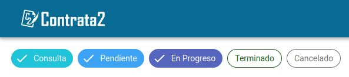
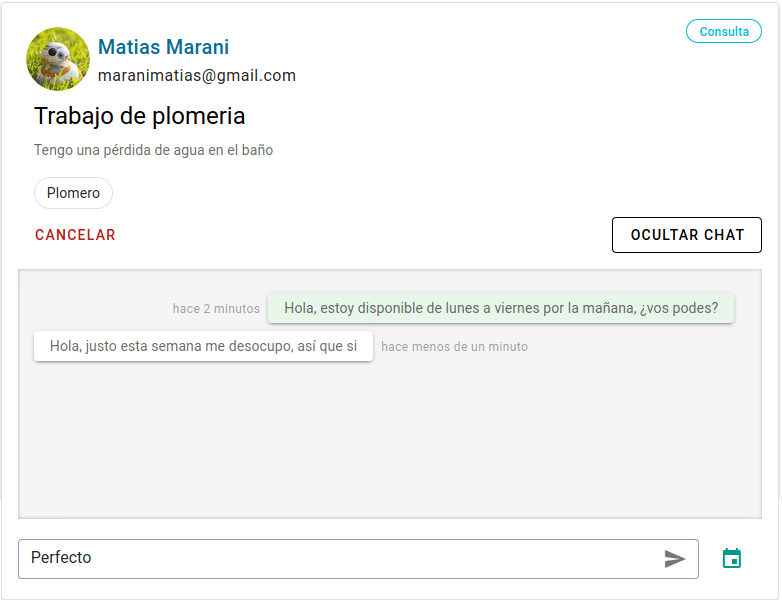

---
#tags:
#  - registrarse con email
---

# Trabajos

**Menu**
[[TOC]]

## Contratar

Ir a la pagina principal de ContrataDos. Puedes llegar hacendo click en el logo
de ContrataDos.

::: tip Nota
Recomendamos esta logeado en ContrataDos.
:::

1. Veras un buscador.

2. Ingrese una profesional o localidad y el buscador inteligente le seguridad
   una opción, agregue las que le parezca.

3. Un vez elegido lo que quieres buscar, pulse el botón _'Buscar un profesional'_.

4. Puede pasar que la búsqueda no arroje un resultado, en ese caso cambie los
   criterios de búsqueda.

::: tip Nota
Si usted es un profesional no aparecerá en su propia búsqueda
:::

5. Listado de profesionales que concuerdan con su búsqueda.

> De cada profesional se muestra información básica, nombre, apellido, profesión,
> foto de perfil y una descripción.

> Las estrellas muestra cuan satisfecho están los clientes con los trabajo que
> realizo el profesional.

6. En cada tarjeta de profesional puedes elegir contratarlo o ver su perfil.

::: tip Nota
Para contratar un profesional debes estar logeado en ContrataDos
:::

7. Al hacer click en el botón contratar, aparecerá un formulario donde puedes
   indicar y contar el trabajo que se necesita.

8. Un ves completado el formulario y enviado (pulsando _'Contratar'_), se le envía
   un email al profesional, también ya puede ver la solicitud de trabajo en su
   listado de trabajo, también ya puede ver la solicitud de trabajo en su listado
   de trabajos.

9. Ver el estado y los detalles de la solicitud, haciendo click en _'trabajos'_ del
   menu principal.

Vera algo como lo siguiente:

::: tip Notas

- Click en _'ver chat'_ para ver la conversación con el profesional.
- También se puede acordar una cita.
- Cada vez que alguno de los dos escriba un mensaje le llegar a demás del mismo
  un email notification que tiene un mensaje, (si tiene los email habilitados).

:::

## Listado de trabajo

Ver el estado y los detalles de un trabajo

### Acordar o proponer una fecha para el trabajo

#### TODO

::: tip Nota

- Cada vez que alguno de los dos proponga una fecha se le enviara un email
  notification que tiene un mensaje, (si tiene los email habilitados).

:::

### Agregar una nota privada al trabajo

1. Ir al listado de trabajo, haciendo click en _'trabajos'_ del menu principal.

Vera algo como lo siguiente:

2. Click en el botón _'Notas'_ junto al botón _'Ver chat'_ en el trabajo

::: warning
Solo los profesionales pueden dejar una nota en los trabajos, solo ellos verán
esas nota.
:::

### Estados de un trabajo

Un trabajo puede tener los siguiente estados, con un color asociado:

- **CONSULTA**: El cliente indica que necesita los servicios de un profesional,
  y todavía no se acorde una fecha.
- **PENDIENTE**: El cliente acepta la fecha elegida por el profesional y
  todavía no llego la fecha.
- **EN PROGRESO**: A partir de la fecha acordada y hasta que el profesional
  marque el trabajo como terminado.
- **TERMINADO**: El profesional marco el trabajo como terminado, ahora se puede publicar.
- **CANCELADO**: El cliente cancela el trabajo o el profesional rechazar el mismo.

#### Donde veo el estado del trabajo

- Ver estado en la ficha de trabajo, lo podes ver en el borde superior a la derecha.
- También podes usar el filtro de la vista para ver solo los trabajos con un
  estado en particular.

En la pantalla trabajos, justo debajo del logo de ContrataDos, veras algo así:

Eso son 'filtros' que permite mostrar solo los trabajos con esos estados, en
este caso veras los trabajos con estados igual a 'CONSULTA', 'PENDIENTE', 'EN PROGRESO'.

Para ver otros trabajos solo tiene que hacer click en el filtro que le corresponda, un
filtro solo puede esta activo o desactivado.

#### Cambiar estado del trabajo

::: warning
Solo los profesionales pueden cambiar de esta un trabajo de forma directa.
Los trabajos con estados **CONSULTA** o **TERMINADO**, no se pueden modificar.
:::

Para cambiar un estado lo podes hacer haciendo click en el botón _'Opciones'_

##### TODO

pasos, modal

### Cambiar fecha programada

#### TODO

### Cancelar o rechazar un trabajo

1. Ir al listado de trabajo, haciendo click en _'trabajos'_ del menu principal.

Vera algo como lo siguiente:

2. Click en el botón _'Cancelar'_ o _'Rechazar'_

::: tip Nota

- Si sos el cliente para ese trabajo veras un botón _'Cancelar'_
- Si sos el profesional para ese trabajo veras un botón _'Rechazar'_

:::

### Clasificar un trabajo

#### TODO

### Comunicarse con el cliente o el profesional

1. Ver el estado y los detalles de la solicitud, haciendo click en _'trabajos'_ del
   menu principal.

Vera algo como lo siguiente:

2. Click en _'ver chat'_ para ver la conversación con el profesional o el cliente,
   según corresponda..

Donde el cuadro gris muestra los mensajes intercambiados, es este caso ninguno.

El icono del calendario permite acordar una fecha.

El rucado inferirlo blanco es una cuadro de texto, donde puedes escribir el
mensaje y enviarlo con el botón _'Enviar'_.

3. Enviar un mensaje, escribirlo en el rectángulo blanco.

> Acá se puede ver una communication desde el cliente al profesional, donde
> los mensajes con fondo verde son los que envía el cliente (en este caso), el
> profesional los con fondo blanco.
>
> También vemos que el cliente escribió 'Perfecto' pero todavía no lo envió.

::: tip Nota

- Cada vez que alguno de los dos escriba un mensaje le llegar a demás del mismo
  un email notification que tiene un mensaje, (si tiene los email habilitados).
- También se puede acordar una cita. Ver como en [Acordar o proponer una fecha para el trabajo](#acordar-o-proponer-una-fecha-para-el-trabajo)

:::

## Agenda

### TODO

## Publicar un trabajo

### TODO

### Publicar un trabajo terminado

#### TODO

### Publicar un trabajo externo a ContrataDos

#### TODO
