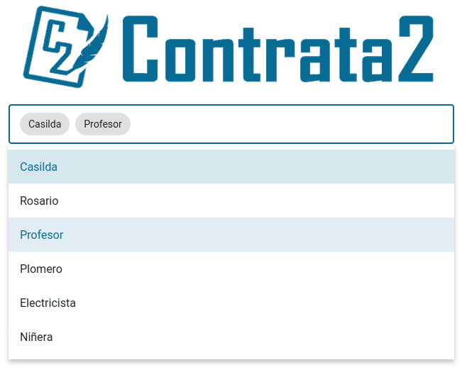

---
#tags:
#  - registrarse con email
---

# Trabajos

**Menu**
[[TOC]]

## Contratar

Ir a la pagina principal de ContrataDos. Puedes llegar hacendo click en el logo
de ContrataDos.

::: tip Nota
Recomendamos esta logeado en ContrataDos.
:::

1. Veras un buscador.

2. Ingrese una profesional o localidad y el buscador inteligente le seguridad
   una opción, agregue las que le parezca.

3. Un vez elegido lo que quieres buscar, pulse el botón _'Buscar un profesional'_.

4. Puede pasar que la búsqueda no arroje un resultado, en ese caso cambie los
   criterios de búsqueda.

::: tip Nota
Si usted es un profesional no aparecerá en su propia búsqueda
:::

5. Listado de profesionales que concuerdan con su búsqueda.

> De cada profesional se muestra información básica, nombre, apellido, profesión,
> foto de perfil y una descripción.

> Las estrellas muestra cuan satisfecho están los clientes con los trabajo que
> realizo el profesional.

6. En cada tarjeta de profesional puedes elegir contratarlo o ver su perfil.

::: tip Nota
Para contratar un profesional debes estar logeado en ContrataDos
:::

7. Al hacer click en el botón contratar, aparecerá un formulario donde puedes
   indicar y contar el trabajo que se necesita.

8. Un ves completado el formulario y enviado (pulsando _'Contratar'_), se le envía
   un email al profesional, también ya puede ver la solicitud de trabajo en su
   listado de trabajo, también ya puede ver la solicitud de trabajo en su listado
   de trabajos.

9. Ver el estado y los detalles de la solicitud, haciendo click en _'trabajos'_ del
   menu principal.

Vera algo como lo siguiente:

::: tip Notas

- Click en _'ver chat'_ para ver la conversación con el profesional.
- También se puede acordar una cita.
- Cada vez que alguno de los dos escriba un mensaje le llegar a demás del mismo
  un email notification que tiene un mensaje, (si tiene los email habilitados).

:::

## Listado de trabajo

### Comunicarse con el cliente o el profesional

### Acordar/Proponer una fecha para el trabajo

### Cambiar fecha programada

### Cambiar estado del trabajo

### Clasificar un trabajo

## Agenda

## Publicar un trabajo

### Publicar un trabajo terminado

### Publicar un trabajo externo a ContrataDos
